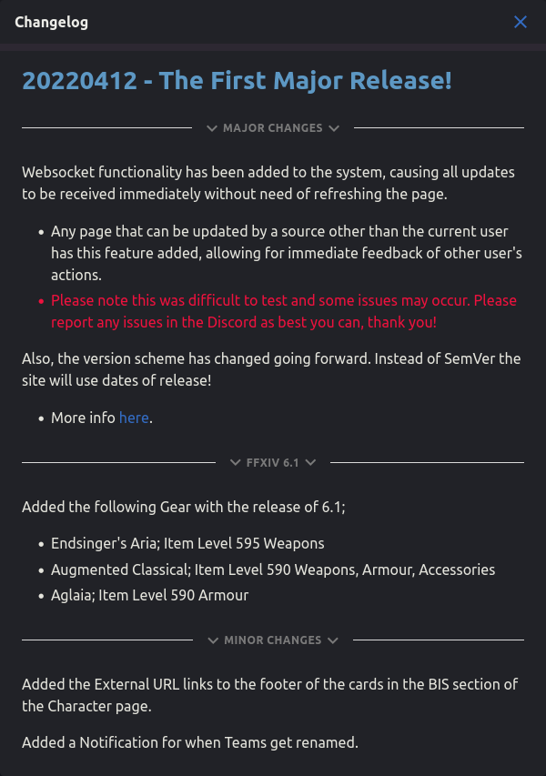

# Changelog

&#x20; (1) (1).png>)

Whenever a new version is deployed, or if you click the Changelog link at the bottom of every page, you will be able to see the Changelog modal.

This is just a way for you to be kept up to date with things that have changed with new deployments, since it won't always be obvious.

## Layout and Versioning

Going forward, Savage Aim will be versioned according to the update's release date. If multiple come out on the same day, the date will have a `.` and the release number added to the end (i.e. `20220412.2`.

The layout of the changelog is broken down into sections that describe the changes. The changes are grouped together by how significant the changes are for the system.

Any FFXIV patch changes (new gear being released) will always be marked as such, otherwise the change sections will be Major, Minor, or any other type of classification!
