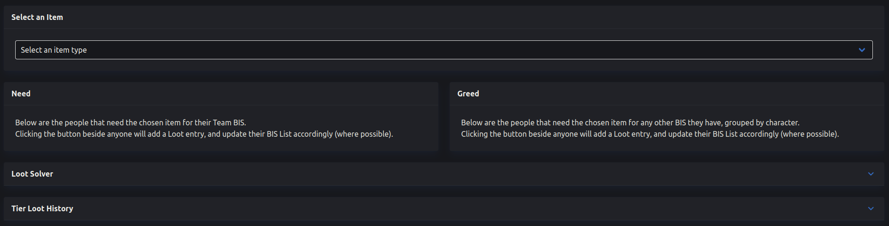

# Join A Team

If instead you are joining someone else's team, you will need to receive either an **invite code** or **invite link** from the Team's Leader.&#x20;


If you're a Team Leader and you're trying to find where to get these, please check [#invite-code](team-settings.md#invite-code "mention").


## Join Via Code

If you're joining via a code, you have a couple of extra steps to do over joining via a URL, which are outlined here!

### Add New Team

Starting from the Home page, click the "Add New" button under "Your Teams". You should be on this page;

 (1) (1).png>)

Insert the code you were given in the box below, and click the "Join" button. If the code is correct, you should be taken to the same page as the **invite link** would have taken you, so we can continue the guide below.

## Joining The Team

Once you have arrived on a page like this, either by following the code step above or by following your given **invite link**, you will be able to join the Team.

.png>)

The box above shows the current details of the Team you are joining. You can see the name and tier and, if you're on a large screen device, you can also see the icons of the Jobs that the Characters already in the Team are playing. The names of the Characters on each Job are available by hovering over them.

The two boxes below provide the different methods for joining an existing Team, which are both outlined below;

### Join using an existing Character

The card on the bottom left of the page provides a small form with which you can select one of your Characters and one of their BIS Lists and have them join the Team.

When you select a Character, the BIS List dropdown will become active and populated with the lists belonging to the Character you selected, like so;

.png>)

The "Add New" button on the right opens a popup if you need to add a BIS List to the chosen Character without leaving the page, perfect for when you are joining a Team with a completely new Character.

#### If you have no Characters

A completely normal situation for the site is something like this;

* You create a Team on Savage Aim for your static, and send the invite link to the others.
* They arrive on the Join page having just made their account, and have no Characters made yet.
* Your Team has no Proxies made for them to claim.

When this happens, instead of providing empty form inputs, the page will now display a separate message, like this;

.png>)

The first option in the list refers to joining via Proxy (see below). The second option refers to opening the Add New Character page in a separate tab using the green button at the bottom.

When a new Character is added and verified, the join page will be updating to reflect this, and will contain selection form instead of this message when the account contains a Character.

### Join by claiming a Proxy Character

The card on the bottom right of the image contains all of the Proxy Characters the Team has currently. If a Team has no Proxy Characters, it will display a message like this;

If the Team does have a Proxy Character, that belongs to you, you can click on them to provide a popup like this;

.png>)

Clicking the green "Claim Character" to confirm will create a copy of this Character in your account, and take you to their page in order to follow the verification process as outlined in [#verifying-your-character](../characters/importing-characters.md#verifying-your-character "mention")

The one extra difference is, whenever a Character that is used as a Proxy in a Team is verified, they will absorb all the Proxy versions into the verified Character, which includes Team Membership and BIS Lists that were made and managed while they were a Proxy.
